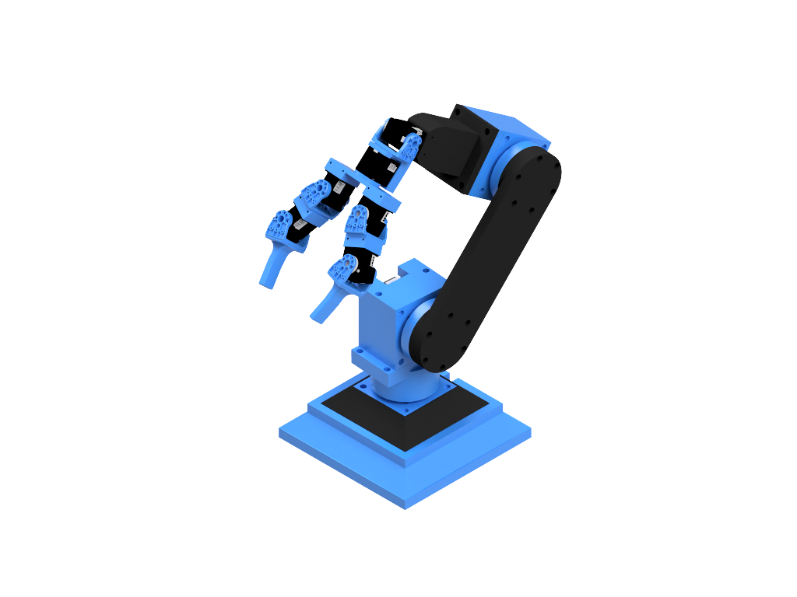

# RobotArm 🤖

A modular, research-grade robotic arm platform built from the ground up to support
**kinematics, motion planning, computer vision, and learned control**.

This project is designed as both a **physical robotic system** and a **software stack**
that scales from direct joint control to higher-level autonomy.  
The long-term goal is a tight integration between **hardware, perception, and intelligence**.
<p align="center">
  
</p>

---

## ✨ Key Features

- **3-DOF stepper-driven arm**
  - TB6600 drivers
  - Cycloidal gear reduction
  - Smooth acceleration-controlled motion

- **Multi-DOF gripper**
  - 6× DYNAMIXEL motors (pinching fingers + wrist orientation)
  - Controlled via OpenRB-150

- **Python control stack**
  - Inverse kinematics (IK)
  - Qt GUI for interactive control
  - Clean serial protocol to embedded controllers

- **Designed for scalability**
  - Future modules for:
    - Computer vision (camera-based grasping)
    - Motion planning & trajectory generation
    - Simulation / digital twin
    - Learned policies & AI-driven behaviors

---

## 🧠 System Architecture

High-level control is handled in Python, while low-level real-time motor control is
delegated to embedded controllers.

---

## 🖥️ Software Stack

- **Python**
  - IK, control logic, GUI, future CV & planning
- **Qt (PySide6)**
  - Desktop GUI
- **Arduino**
  - Stepper pulse generation + safety
- **DYNAMIXEL SDK**
  - Smart actuator control

---

## 🚀 Quick Start

```bash
python -m venv .venv
# Windows
.venv\Scripts\activate

pip install -U pip
pip install -e .
python scripts/run_gui.py

